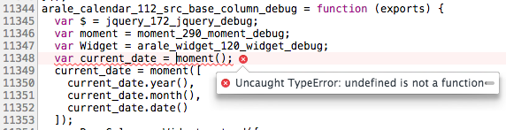

# linkage [](http://spmjs.io/package/linkage)

---


## Usage

for debug (good):

```bash
$ spm-server
$ open http://127.0.0.1:8000/index.html
```

after build (bad):

```bash
$ spm build -O .
$ open ./index.html
```


